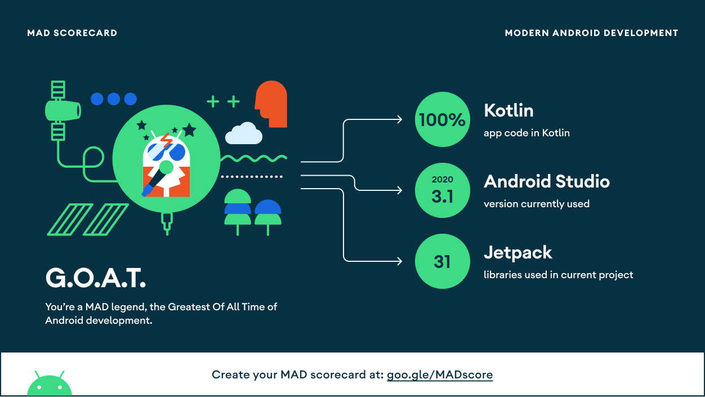

<h1 align="center">CryptoWorld</h1>

CryptoWorld is a demo app based on Jetpack Compose. The app uses modern tech-stack and it is based on Clean Architecture.
The project is quite simple which shows the list of crypto currencies and gives a functionality of conversion with another crypto currency

 

## Tech stack & Open-source libraries
- Minimum SDK level 21
- [Kotlin](https://kotlinlang.org/) based, [Coroutines](https://github.com/Kotlin/kotlinx.coroutines) + [LiveData](https://developer.android.com/topic/libraries/architecture/livedata) for asynchronous.
- JetPack
  - LiveData - notify domain layer data to views.
  - Lifecycle - dispose of observing data when lifecycle state changes.
  - ViewModel - UI related data holder, lifecycle aware.
  - Hilt for dependency injection.
  - Navigation - navigation between compose UI screens.
  - Compose - provides beautiful UI based on [Kotlin](https://kotlinlang.org/).
  - KTX - Provide concise, idiomatic Kotlin to Jetpack, Android platform, and other APIs.
  - [Retrofit2 & OkHttp3](https://github.com/square/retrofit) - construct the REST APIs and paging network data.
  - [Timber](https://github.com/JakeWharton/timber) - logging.
  - [Material-Components](https://material.io/blog/jetpack-compose-beta) - Material design using Compose.

- Clean Architecture

- Architecture
  - This project is based on MVVM architecture using repository pattern
 

## MAD Score

## Open API

CryptoWorld using the [Coin Layer API](https://coinlayer.com/documentation) for constructing RESTful API. 
CoinLayer API provides a RESTful API interface that provides all the details of crypto currencies.
You will need to provide the ***API_KEY*** in the ***app/build.gradle*** file to use the restful api

## Mock API Layer
- You can use mock-api branch to use the app without providing the ***API_KEY***

## Find this repository useful? :heart:
Connect with me on __[LinkedIn](https://www.linkedin.com/in/harris-das-232636125/)__  
And __[follow](https://github.com/harrisdas)__ me for my next creations! 🤩

# License
<pre><code class="xml">Designed and developed by 2021 Harris Das

Licensed under the Apache License, Version 2.0 (the &quot;License&quot;);
you may not use this file except in compliance with the License.
You may obtain a copy of the License at

   http://www.apache.org/licenses/LICENSE-2.0

Unless required by applicable law or agreed to in writing, software
distributed under the License is distributed on an &quot;AS IS&quot; BASIS,
WITHOUT WARRANTIES OR CONDITIONS OF ANY KIND, either express or implied.
See the License for the specific language governing permissions and
limitations under the License.
</code></pre>
